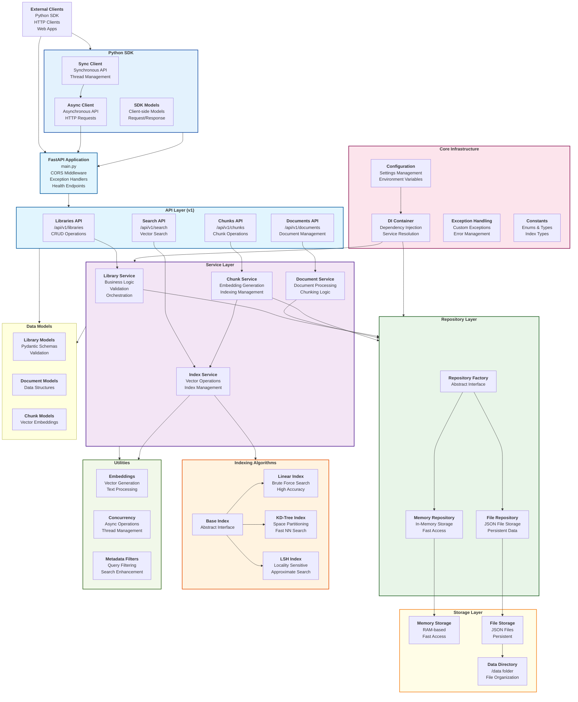

# VectorDB - Production-Ready Vector Database 

A high-performance, scalable vector database with advanced indexing algorithms, metadata filtering, persistence, clustering, and comprehensive Python SDK.

## Features

### Core Database Features
- **Multiple Index Types**: Linear, KD-Tree, and LSH for different use cases
- **Similarity Metrics**: Cosine, Euclidean, and Dot Product
- **Advanced Metadata Filtering**: Complex queries with 17 operators, date ranges, regex, nested fields
- **Async Performance**: Full async/await support with efficient I/O
- **Concurrency Control**: Thread-safe operations for concurrent requests

### API & SDK
- **RESTful API**: Comprehensive FastAPI-based REST interface
- **Python SDK**: Both async and sync clients with retry logic
- **Type Safety**: Full Pydantic validation and static typing
- **Batch Operations**: Efficient bulk inserts and searches

### Production Ready
- **Docker Support**: Multi-stage builds with health checks
- **File Persistence**: Automatic JSON-based storage with volume mounting
- **Error Handling**: Comprehensive exception handling and validation
- **Monitoring**: Health checks, system status, and performance metrics

## Quick Start

### Using Docker (Recommended)

```bash
# Clone the repository
git clone https://github.com/jairajc/vector_db_project.git
cd vector_db_project

# Start with Docker Compose
docker-compose up --build

# API will be available at http://localhost:8000
```

### Manual Installation

```bash
# Install dependencies
pip install -r requirements.txt
cp .env_example .env

# Start the server
uvicorn app.main:app --host 0.0.0.0 --port 8000 --reload
```

### Using the Python SDK

```bash
# Install the SDK
cd python_sdk
pip install -e .
```

## Usage Examples

### Basic Operations

```python
from vectordb_client import VectorDBClient

# Initialize client
client = VectorDBClient("http://localhost:8000")

# Create a library with LSH indexing
library = client.create_library_simple(
    name="My Documents",
    description="Document embeddings",
    index_type="lsh",
    similarity_metric="cosine"
)

# Add text chunks with proper metadata structure
chunk = client.add_text_chunk(
    library_id=library.id,
    text="Artificial intelligence is transforming the world",
    metadata={
        "source": "AI Research",
        "page_number": 1,
        "section": "Introduction",
        "custom_fields": {
            "category": "technology",
            "difficulty": "intermediate",
            "tags": ["AI", "technology", "transformation"]
        }
    }
)

# Search with metadata filtering
results = client.search_text(
    library_id=library.id,
    query="machine learning applications",
    limit=10,
    min_similarity=0.1  # Use realistic similarity thresholds
)

for result in results:
    print(f"Text: {result['text'][:100]}...")
    print(f"Similarity: {result['similarity']:.3f}")
    print(f"Source: {result['metadata'].get('source', 'Unknown')}")
    print("---")
```

### Advanced Metadata Filtering (17 Operators)

```python
from vectordb_client import AsyncVectorDBClient, MetadataFilter
from datetime import datetime, timedelta

async def advanced_search_example():
    async with AsyncVectorDBClient() as client:
        # Create complex metadata filters using all 17 operators
        filters = [
            # String operations
            MetadataFilter(field="source", operator="eq", value="Research Paper"),
            MetadataFilter(field="custom_fields.author", operator="ne", value="Unknown"),
            MetadataFilter(field="custom_fields.title", operator="contains", value="AI"),
            MetadataFilter(field="custom_fields.abstract", operator="starts_with", value="This paper"),
            MetadataFilter(field="custom_fields.conclusion", operator="ends_with", value="future work."),
            MetadataFilter(field="custom_fields.keywords", operator="regex", value=r"machine\s+learning"),
            
            # Numeric operations
            MetadataFilter(field="page_number", operator="gt", value=10),
            MetadataFilter(field="custom_fields.citations", operator="gte", value=50),
            MetadataFilter(field="custom_fields.year", operator="lt", value=2024),
            MetadataFilter(field="custom_fields.score", operator="lte", value=0.95),
            
            # List operations
            MetadataFilter(field="custom_fields.categories", operator="in", value=["AI", "ML", "DL"]),
            MetadataFilter(field="custom_fields.exclude_tags", operator="not_in", value=["draft", "private"]),
            MetadataFilter(field="custom_fields.topics", operator="array_contains", value="neural networks"),
            MetadataFilter(field="custom_fields.authors", operator="array_length", value=3),
            
            # Field existence
            MetadataFilter(field="custom_fields.doi", operator="exists", value=True),
            MetadataFilter(field="custom_fields.draft_notes", operator="not_exists", value=True),
            
            # Date range operations
            MetadataFilter(
                field="created_at",
                operator="date_range",
                value={
                    "start": (datetime.now() - timedelta(days=30)).isoformat(),
                    "end": datetime.now().isoformat()
                }
            )
        ]
        
        # Search with combined filters
        response = await client.search(
            library_id=library.id,
            query="neural networks deep learning",
            k=20,
            metadata_filters=filters[:5],  
            filter_mode="and"
        )
        
        return response.results
```

### Batch Operations

```python
# Batch insert chunks
from vectordb_client.models import ChunkCreate

chunks = [
    ChunkCreate(
        text=f"Document {i} content about machine learning",
        metadata={
            "source": f"Document {i}",
            "page_number": i,
            "custom_fields": {
                "doc_id": i,
                "category": "ml",
                "difficulty": "beginner" if i % 3 == 0 else "intermediate"
            }
        }
    )
    for i in range(100)
]

# Create all chunks in batches of 50
created_chunks = await client.create_chunks_batch(
    library_id=library.id,
    chunks=chunks,
    batch_size=50
)

# Search across multiple libraries
library_ids = ["lib1", "lib2", "lib3"]
results = await client.search_multiple_libraries(
    library_ids=library_ids,
    query="deep learning",
    k=10
)
```

## Architecture & Data Model

### System Architecture

VectorDB follows a layered architecture with clear separation of concerns:




**Components:**
- **Client Layer**: Python SDK, REST clients
- **API Gateway**: FastAPI with validation and exception handling  
- **Service Layer**: Business logic for libraries, documents, chunks, and search
- **Repository Layer**: Data access abstraction supporting multiple storage backends
- **Storage Layer**: JSON file persistence with vector indexes

**Data Model:**
- **Libraries**: Top-level containers with configurable indexing strategies
- **Documents**: Logical groupings of text content with rich metadata
- **Chunks**: Searchable text segments with embeddings and custom fields
- **Indexes**: Optimized data structures for fast similarity search

### Metadata Structure

VectorDB uses a specific metadata structure for proper validation and filtering:

```python
# Correct metadata structure
metadata = {
    # Top-level fields (validated by ChunkMetadata model)
    "source": "Research Paper",
    "page_number": 15,
    "section": "Results",
    "created_at": "2024-01-15T10:30:00Z",
    "updated_at": "2024-01-15T11:00:00Z",
    
    # All custom fields must be nested under 'custom_fields'
    "custom_fields": {
        "author": "Dr. Smith",
        "category": "research",
        "difficulty": "advanced",
        "tags": ["AI", "ML", "research"],
        "citations": 42,
        "keywords": ["neural networks", "deep learning"],
        "published_year": 2024
    }
}

# Use dot notation for filtering nested fields
filter = MetadataFilter(
    field="custom_fields.difficulty",
    operator="eq", 
    value="advanced"
)
```

### Index Performance Comparison

| Index Type | Build Time | Search Time | Memory Usage | Update Cost | Best Use Case |
|------------|------------|-------------|--------------|-------------|---------------|
| Linear     | O(1)       | O(n)        | Low          | O(1)        | <10K vectors, prototyping |
| KD-Tree    | O(n log n) | O(log n)    | Medium       | O(log n)    | 10K-100K vectors, structured data |
| LSH        | O(n)       | O(1) avg    | High         | O(1)        | >100K vectors, approximate search |

## Deployment

### Docker Compose with Persistence

```yaml
version: '3.8'
services:
  vector-db-api:
    build: .
    ports:
      - "8000:8000"
    environment:
      - DEBUG=true
      - LOG_LEVEL=INFO
      - PERSISTENCE_TYPE=file
      - DATA_DIRECTORY=/app/data
      - COHERE_API_KEY=${COHERE_API_KEY}
    volumes:
      - ./data:/app/data  # Persistent storage
    restart: unless-stopped
    healthcheck:
      test: ["CMD", "curl", "-f", "http://localhost:8000/health"]
      interval: 30s
      timeout: 10s
      retries: 3
      start_period: 40s
```

### Data Persistence

VectorDB automatically persists all data to the filesystem:

**Storage Structure:**
```
./data/
├── library/     # Library definitions and configurations
├── document/    # Document metadata and content
└── chunk/       # Text chunks with embeddings and metadata
```

**Benefits:**
- **Automatic**: Works with Docker volumes, no configuration needed
- **Durable**: Data survives container restarts
- **Human Readable**: JSON files can be inspected and backed up
- **Cross-Platform**: Works on any system with file storage

### Kubernetes Deployment

```yaml
apiVersion: apps/v1
kind: Deployment
metadata:
  name: vectordb
spec:
  replicas: 1
  selector:
    matchLabels:
      app: vectordb
  template:
    metadata:
      labels:
        app: vectordb
    spec:
      containers:
      - name: vectordb
        image: vectordb:latest
        ports:
        - containerPort: 8000
        env:
        - name: PERSISTENCE_TYPE
          value: "file"
        - name: DATA_DIRECTORY
          value: "/app/data"
        volumeMounts:
        - name: data
          mountPath: /app/data
        livenessProbe:
          httpGet:
            path: /health
            port: 8000
          initialDelaySeconds: 30
          periodSeconds: 10
        readinessProbe:
          httpGet:
            path: /health  
            port: 8000
          initialDelaySeconds: 5
          periodSeconds: 5
      volumes:
      - name: data
        persistentVolumeClaim:
          claimName: vectordb-data
---
apiVersion: v1
kind: PersistentVolumeClaim
metadata:
  name: vectordb-data
spec:
  accessModes: ["ReadWriteOnce"]
  resources:
    requests:
      storage: 10Gi
```

## Configuration

### Environment Variables

```bash
DEBUG=true
LOG_LEVEL=INFO
PERSISTENCE_TYPE=file
DATA_DIRECTORY=/app/data
COHERE_API_KEY=your_api_key_here
```

## Technology Stack

**Backend Framework:**
- **FastAPI**: Modern, fast web framework for building APIs
- **Pydantic**: Data validation and settings management
- **Uvicorn**: ASGI server for production deployment

**Vector Processing:**
- **NumPy**: Numerical computing and vector operations
- **SciPy**: Scientific computing and advanced algorithms
- **Scikit-learn**: Machine learning utilities for LSH and KD-Tree
- **Cohere API**: Professional embedding generation service

**Storage & Deployment:**
- **JSON Files**: Human-readable data and metadata storage
- **Docker**: Containerization and consistent environments
- **Docker Compose**: Easy deployment and management

## Testing

### Postman Collection Testing

The project includes a comprehensive Postman collection (`Vector_Database_API_Complete_Collection.json`) with:

- **Complete API Coverage**: All 20+ endpoints
- **Advanced Metadata Filtering**: Tests for all 17 operators
- **LSH Configuration**: Proper parameter testing
- **Search Workflows**: Comprehensive test suite with realistic data
- **Error Handling**: Validation and edge case testing

```bash
# Import the collection into Postman
# File: Vector_Database_API_Complete_Collection.json

# Set environment variables in Postman:
base_url = http://localhost:8000
```

### SDK Testing

```python
# tests/test_sdk_usage.py
import pytest
from vectordb_client import VectorDBClient, AsyncVectorDBClient

@pytest.mark.asyncio
async def test_async_client():
    async with AsyncVectorDBClient("http://localhost:8000") as client:
        # Test health check
        health = await client.health_check()
        assert health.status == "healthy"
        
        # Test library operations
        library = await client.create_library_simple("Test Library")
        assert library.name == "Test Library"
        
        # Test search
        results = await client.search_simple(library.id, "test query")
        assert isinstance(results.results, list)
```

### Interactive Documentation

```bash
# Start the server and visit:
# http://localhost:8000/docs      - Swagger UI
# http://localhost:8000/redoc     - ReDoc
# http://localhost:8000/openapi.json - OpenAPI spec